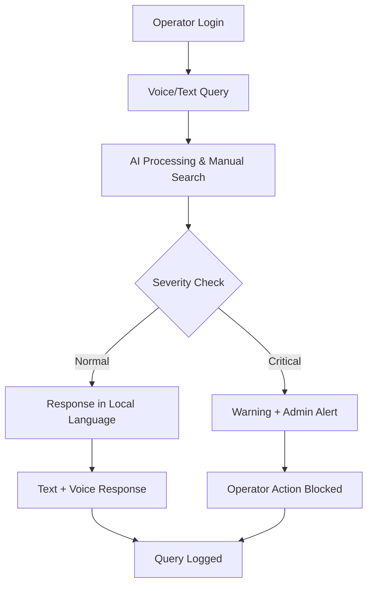

# Our team is currently working on this project

# 🤖 TalkToMachine

**AI-Powered Vernacular Voice + Text Assistant for MSME Machine Operators**

An intelligent assistant that helps machine operators communicate with their equipment through voice and text in local languages, featuring real- 

## 🎯 Overview

TalkToMachine bridges the communication gap between MSME machine operators and technical documentation by providing an AI assistant that understands queries in local languages, searches through machine manuals, and responds with actionable guidance - all through voice and text interfaces.

### 🎪 **Demo Features**
- 🎤 **Voice Input**: Speak your questions in your local language
- 🧠 **Smart Search**: AI searches through uploaded machine manuals and FAQs
- 🗣️ **Voice Response**: Get answers back in both text and voice
- ⚠️ **Critical Issue Detection**: Automatic warnings for dangerous situations
- 🔔 **Real-time Alerts**: Instant notifications to supervisors for critical issues

---

## 🚀 Core Features

### 👷 **Operator App** (Web + Mobile-friendly)
- **Multi-input Support**: Voice (speech-to-text) and text input
- **Machine Query Processing**: Ask about operations, troubleshooting, or handling procedures
- **AI-Powered Search**: Uses LangChain + FAISS to search uploaded manuals and FAQs
- **Multilingual Response**: Answers in local language with both text and voice (TTS)
- **Safety First**: Critical issue detection shows warnings and alerts administrators

### 👨‍💼 **Admin Dashboard**
- **Document Management**: Upload machine manuals, SOPs, troubleshooting guides (PDF, DOC, text, images)
- **Real-time Monitoring**: View all operator queries as they happen
- **Instant Notifications**: Get notified via Firebase Cloud Messaging or email
- **Query Analytics**: View logs of past queries with deletion control

### 🏢 **Super Admin** (Enterprise Level)
- **Multi-Enterprise Management**: Oversee multiple enterprises from one dashboard
- **Admin Control**: Add/remove enterprise administrators
- **Usage Analytics**: High-level usage data and insights

### 🎛️ **Enterprise Admin**
- **Operator Management**: Add/remove operators and assign machines
- **Manual Assignment**: Control which manuals each operator can access
- **Critical Alerts**: Receive immediate notifications for high-severity issues

---

## 🛡️ Safety & Intelligence

### 🚨 **Critical Issue Detection**
- **NLP-Powered Analysis**: Uses Rasa NLU or Hugging Face models for intent classification
- **Severity Assessment**: Automatically categorizes queries as info/warning/critical
- **Safety Lockdown**: High-severity issues trigger operator action blocks and immediate admin alerts

### 🔔 **Smart Notifications**
- **Real-time Alerts**: Firebase Cloud Messaging for instant notifications
- **Categorized Alerts**: Info, Warning, and Critical severity levels
- **Multi-channel**: Email and push notifications

---

## 🛠️ Tech Stack

| Category | Technology | Purpose |
|----------|------------|---------|
| **Frontend** | React + Material UI | Clean, mobile-responsive interface |
| **Backend** | Node.js + Express | RESTful API and business logic |
| **Database** | MongoDB Atlas | Document storage (free tier) |
| **Authentication** | JWT | Role-based access (Operator/Admin/Super Admin) |
| **AI Processing** | LangChain + FAISS | Semantic search in manuals |
| **Intent Classification** | Hugging Face | Critical vs normal issue detection |
| **Speech-to-Text** | Vosk / Google STT | Offline/cloud voice processing |
| **Text-to-Speech** | Coqui TTS | Open-source voice synthesis |
| **Notifications** | Firebase Cloud Messaging | Real-time alerts (free tier) |
| **File Storage** | Firebase Storage | Manual and document storage |

---

## 🎨 Design System

- **Primary Color**: Dark Blue (`#293B5F`) - Professional and trustworthy
- **Background**: Light Gray (`#F0F4F8`) - Easy on the eyes
- **Accent Color**: Orange (`#E67700`) - Alerts and warnings
- **Typography**: Inter (Google Fonts) - Clean and readable
- **Style Philosophy**: Industrial, clear, functional - prioritizing usability over aesthetics

---

## 📁 Project Structure

```
📦 TalkToMachine
├── 📁 client/              # React frontend
│   ├── 📁 components/      # Reusable UI components
│   ├── 📁 pages/          # Route components
│   └── 📁 hooks/          # Custom React hooks
├── 📁 server/              # Express backend
│   ├── 📁 routes/
│   │   ├── auth.js        # Authentication routes
│   │   ├── operator.js    # Operator queries, STT/TTS
│   │   ├── admin.js       # Manual uploads, logs, alerts
│   │   └── superadmin.js  # Enterprise management
│   ├── 📁 models/         # MongoDB schemas
│   │   ├── User.js        # User model
│   │   ├── Enterprise.js  # Enterprise model
│   │   ├── Manual.js      # Manual model
│   │   ├── QueryLog.js    # Query logging
│   │   └── Notification.js # Notification model
│   └── 📁 services/       # Business logic
└── 📁 docs/               # Documentation
```

---

## 🚀 MVP Workflow



1. **Operator logs in** → Access granted based on assigned machines
2. **Query submitted** → Via microphone or text input
3. **AI processes** → Searches relevant manuals using semantic search
4. **Response generated** → Delivered in local language (text + voice)
5. **Safety check** → High severity = operator warned + admin alerted
6. **Admin oversight** → Can view queries and take action
7. **Enterprise management** → Super admin oversees multiple enterprises

---

## 💰 Cost-Effective Architecture

### 🆓 **Free Tier Components**
- **Speech-to-Text**: Vosk (offline, completely free)
- **Text-to-Speech**: Coqui TTS (open-source)
- **AI NLP**: Hugging Face free inference API
- **Authentication**: JWT (self-implemented)
- **Notifications**: Firebase Cloud Messaging (free tier)
- **Storage**: Firebase Storage (free tier)
- **Database**: MongoDB Atlas (free tier)
- **Search**: LangChain + FAISS (open-source)

### 📊 **Scalability Plan**
- Start with free tiers for MVP
- Upgrade to paid plans as user base grows
- Modular architecture allows component-wise scaling

---

## 🚀 Getting Started

### Prerequisites
- Node.js 18+
- MongoDB Atlas account
- Firebase project setup
- Basic understanding of React and Express

### Quick Setup
```bash
# Clone the repository
git clone https://github.com/Cyberpradeep/TalkToMachine.git
cd TalkToMachine

# Install dependencies
npm install

# Set up environment variables
cp .env.example .env
# Edit .env with your configurations

# Start development servers
npm run dev:client    # Frontend (React)
npm run dev:server    # Backend (Express)
```

---

## 🎯 Target Audience

- **Primary**: MSME machine operators in manufacturing
- **Secondary**: Factory supervisors and maintenance teams
- **Enterprise**: Manufacturing companies with multilingual workforce

---

## 📈 Roadmap

- [ ] **Phase 1**: MVP with basic voice/text query processing
- [ ] **Phase 2**: Advanced AI models and multi-language support
- [ ] **Phase 3**: Mobile app for Android/iOS
- [ ] **Phase 4**: Integration with IoT sensors and machine data
- [ ] **Phase 5**: Predictive maintenance features

---


## 👥 Team

- **Cyberpradeep** - Project Lead - [@Cyberpradeep](https://github.com/Cyberpradeep)
- **Malleswaran-p** - Team Member - [@Malleswaran-p](https://github.com/Mallesh14)
- **Harish Kanna** - Team Member

---

## 👨‍💻 Author

**Pradeep** - [@Cyberpradeep](https://github.com/Cyberpradeep)
- 📧 Email: pradeepnaveen930@gmail.com
- 💼 LinkedIn: [Connect with me](https://www.linkedin.com/in/harishkanna-p-2079972a0 )

---

## 🙏 Acknowledgments

- The MSME community for inspiring this project
- Open-source AI/ML community for providing free tools
- Firebase and MongoDB teams for excellent free-tier offerings

---

<div align="center">

**🚀 Empowering MSME operators with AI-powered assistance in their native language**

Made with ❤️ for the manufacturing community

[⭐ Star this repo](https://github.com/Cyberpradeep/TalkToMachine) | [🐛 Report Issues](https://github.com/Cyberpradeep/TalkToMachine/issues) | [💡 Request Features](https://github.com/Cyberpradeep/TalkToMachine/issues/new)

</div>
